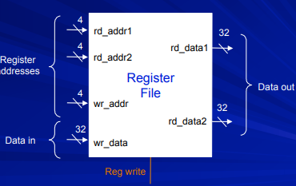
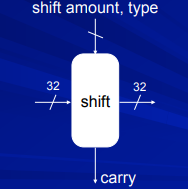
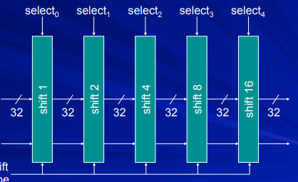
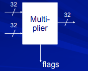

# CPU-ARM
Design, implementation and simulation of a complete ARM based CPU.

### About [ARM](https://www.arm.com/)

An ARM processor is one of a family of CPUs based on the RISC (reduced instruction set computer) architecture developed by Advanced RISC Machines (ARM). ARM makes 32-bit and 64-bit RISC multi-core processors. Click [here](https://en.wikipedia.org/wiki/ARM_architecture) for more.

We divide this making of CPU processor based on ARM instruction set architecture into 2 parts.

- <a href="#part1">1. Design and Implementation</a>
- <a href="#part2">2. Simulation</a>

## Design and Implementation

### VHDL files and their usage

#### Register File

A register file is an array of processor registers in a central processing unit (CPU). Such RAMs are distinguished by having dedicated read and write ports, whereas ordinary multiported SRAMs will usually read and write through the same ports.

We will here implement register file as shown -

- **rd_addr1** and **rd_addr2** are signals as `STD_LOGIC_VECTOR` of 4 bits, containing the register address in reg-file. The data that will get fetched at these 2 addresses will get out from **rd_data1** and **rd_data2** respectively, which are 32 bits `STD_LOGIC_VECTOR`.

- **wr_addr** is the signal which will contain the address of the register in which we shall be writing the correspoding data from the **wr_data** signal.

- **wr_data** is the signal with the data input which shall be written in the register with the address as **wr_addr**.

- Reg write is also needed, whose high state will convey the meaning that their is a need to write in regsiter. We will be implementing it will control signal **RW**. 

#### Shifter

A shifter will shift the input 32-bit data value by a given amount and depending on the input type as Left shift, right shift unsigned, signed right shift and rotation characterised in ARM as **LSL**, **RSL**, **ASL** and **ROR** respectively.

We will be making 5 different shifting entities which will be shifting the bits through a different amount, which will be 1 bits, 2 bits, 4 bits, 8 bits and 16 bits. For e.g. if we have to shift the 32-bit data input by 25 amount, our shifter architecture will shift it as 1+8+16, where 2 bits and 4 bits will not shift the input.

#### ALU(Arithmetical and logical unit)

An arithmetic logic unit (ALU) is a combinational digital electronic circuit that performs arithmetic and bitwise operations on integer binary numbers. 

Our implementation of ALU will be as follows -

- **a** and **b** are 32-bit input `STD_LOGIC_VECTOR`, the data on which we will operate.
- **carry** as `STD_LOGIC` and **opcode** as 4-bit `STD_LOGIC_VECTOR` are rest inputs.
- **result** is the answer of the operation and **Flags** will be the 4-flags; Zero-flag, Negative-flag, Carry-flag and Overflow flag.

#### Multiplier

Multiplier takes 2 32-bit data values and perform the multiplication operation on it and then output the last 32 bits of resulting vector(the resulting vector could be upto 64-bits).

#### Temporary Memory

It can store upto 1024 `STD_LOGIC_VECTOR` of 32-bit data values.

### Datapath
